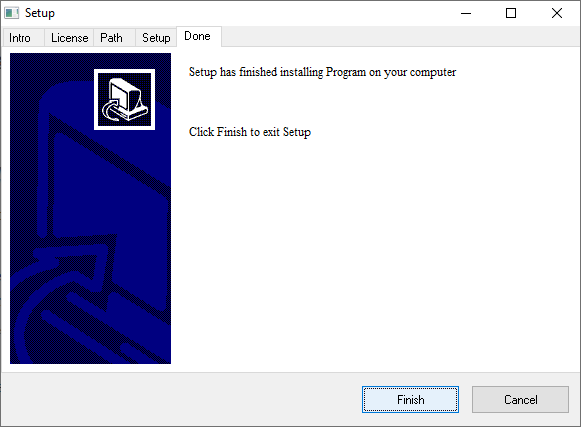

# intallation-wizard
Create installation wizard 

Implement the "installer" program. The program must have at least 4 transitions, in which it is mandatory to be familiar with the copyright, the choice of the directory where the program will be installed, the installation bar.

